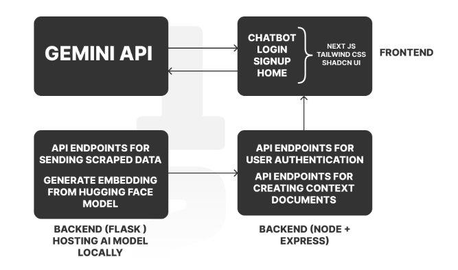

<h1>AILO : Not your regular customer support</h1>

<h4>Ailo isn’t just another digital assistant; it’s your company’s personalized support expert, finely tuned to your unique needs.</h4>

<h4>Ailo is powered by advanced AI that’s specifically trained on your company’s website content, ensuring it delivers highly relevant and accurate responses.</h4>

<h4>Ailo understands your company’s nuances and intricacies, transforming customer interactions into seamless, satisfying experiences. Elevate your customer support with Ailo, where expertise meets personalization for exceptional service.</h4>

<h2>IMPLEMENTATION</h2>
 

<h2>TECHNOLOGIES USED</h2>

- REACT
- FLASK
- MONGODB
- BEAUTIFULSOUP
- NODE.JS
- EXPRESS.JS
- NEXT.JS
- HUGGING FACE
- SHADCN

### Star!!

I will be very thankful to you if you give this creation of mine a big star.
